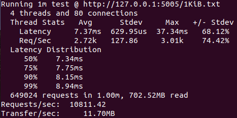
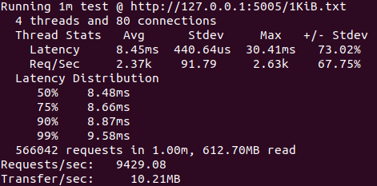
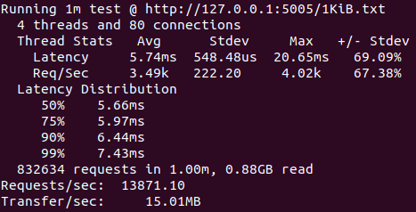
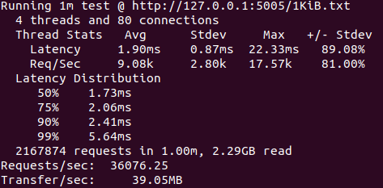
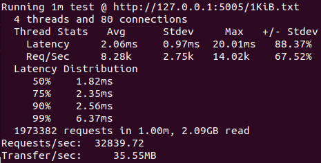
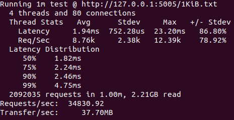
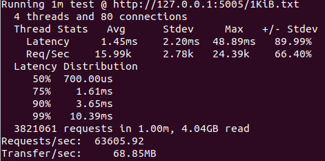

# simple webserver

处理简单HTTP请求的Web Server，只处理请求行，忽略首部。

使用wrk请求1KiB文件，测试对比性能。

```shell
./wrk -c 80 -t 4 --latency -d 60 http://127.0.0.1:5005/1KiB.txt
```


## 单进程



## 多进程



## 多线程



## 单进程select



## 单进程poll



## 单进程epoll



## 线程池


